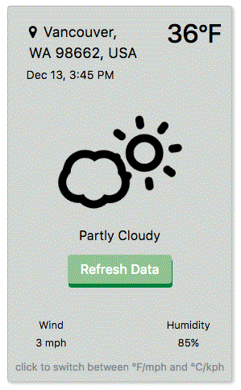

# Weather App
In this project I made a reusable weather app.
It pulls the user location from the browser as longitude and latitude.
The longitude and latitude is then used to pull the current weather from forcast.io.
Reverse goeocoding is also done with the longitude and latitude useing a google maps.
Then the current weather is displayed.
The user can click on the widget to switch units of measurements.
Below is a screen shot of the final product covered in class.
The color scheem changes baised on the current weather.

#Project Goal

##Project Challanges
- Add a refresh button on component.
- Show the data and time of the last time the data was refreshed.

##Custom Tweeks
- Add temperature units next to temperature.
- Use the same unit system for both temperature and speed.
- Changed some of the styling.
- Made a refresh button.
- Added the date and time.

##Current Screen Shoot

## Project Dependencies

### NPM Libraries
- Font Awesome
- Bootstrap

### Custom Libraries
- "app/weather-widget/libraries/skycons/skycons.js"

### Modules
- Jsonp
- Http

### Components
- { WeatherComponent } from './weather-widget/component/weather.component'

### Custom Pipes
- { SpeedUnitPipe } from './weather-widget/pipe/speed-unit.pipe'
- { TempUnitPipe } from './weather-widget/pipe/temp-unit.pipe'

