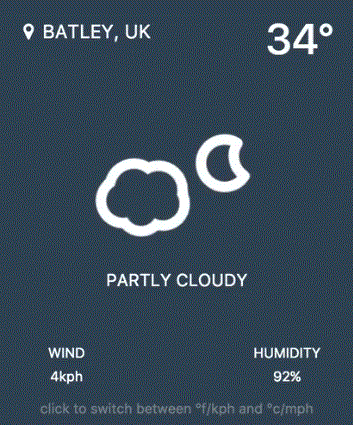

# Weather App
In this project I made a reusable weather app.
It pulls the user location from the browser an then uses that info to get their weather info to display.
Below is a screen shot of the desired produt.

## Project Dependencies

### NPM Libraries
- Font Awesome
- Bootstrap

### Custom Libraries
- "app/weather-widget/libraries/skycons/skycons.js"

### Modules
- Jsonp
- Http

### Components
- { WeatherComponent } from './weather-widget/component/weather.component'

### Custom Pipes
- { SpeedUnitPipe } from './weather-widget/pipe/speed-unit.pipe'
- { TempUnitPipe } from './weather-widget/pipe/temp-unit.pipe'